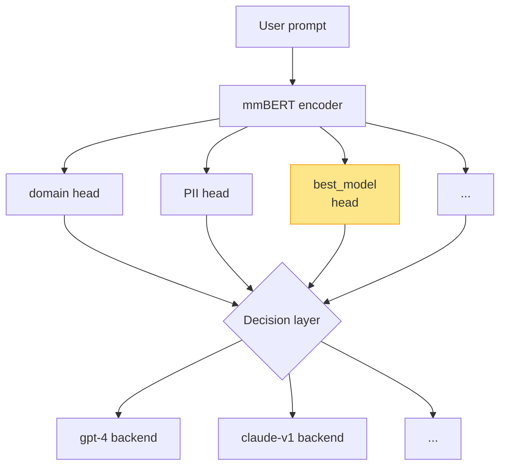

# Arena Router

## Training a mmBERT routing classifier on LMSYS Arena preferences

DDA 4080 Capstone Defense · 2026-05-16

<div class="pt-12">
  <span @click="$slidev.nav.next" class="px-2 py-1 rounded cursor-pointer hover:bg-white/10">
    Press space for next page <carbon:arrow-right class="inline"/>
  </span>
</div>

<!--
**EN.** Good morning. I'll defend my DDA 4080 capstone — training a mmBERT routing classifier on LMSYS Chatbot Arena preference data for the vLLM Semantic Router project. The talk has three parts: the problem framing, the seven critical-engineering findings I documented, and a final summary of where the project stands. Total time about 25 minutes plus questions.

**中文.** 各位老师好。我答辩的是 DDA 4080 Capstone — 用 LMSYS Arena 人类偏好数据为 vLLM Semantic Router 项目训一个 mmBERT 路由分类器。汇报分三部分：问题定义、七个关键工程发现、项目当前结论。整体大约 25 分钟加问答。
-->

---
layout: section
---

# 1. Problem & Approach

<!--
**EN.** First section: what is the problem, what data do we have, and what infrastructure does it plug into.

**中文.** 第一部分：问题是什么、数据是什么、上下游基础设施怎么对接。
-->

---

# vLLM Semantic Router (VSR) routing task

VSR routes each user prompt to the *best* backend model out of a deployed pool.

<div grid="~ cols-2 gap-6">

<div>

### Architecture

- **Signal-decision** pattern (v0.2 "Athena")
- Production encoder: `mmbert-32k-yarn`
- Per-prompt → per-signal classifier → backend pick
- Existing classifier heads: domain / PII / jailbreak / modality / feedback / fact-check

### Our task

Add a **`model_routing`** signal head: `prompt → P(model wins)`

</div>

<div>



</div>
</div>

<!--
**EN.** VSR is vLLM's semantic-router project. v0.2 codename Athena. The pattern is signal-decision: each user prompt runs through several BERT-class classifier heads — domain, PII, jailbreak, modality — and the decision layer picks a backend based on those signals. The encoder is jhu-clsp/mmBERT-base, extended to 32K context with YaRN. My task adds one more signal head, `model_routing`, that maps a prompt to the model most likely to give the best answer. I highlight the new head in yellow on the diagram. The architecture is fixed; what I trained is just one new classifier head.

**中文.** VSR 是 vllm-project 的语义路由器，v0.2 代号 Athena。模式是 signal-decision：每条 prompt 过若干 BERT 分类器头（domain、PII、jailbreak、modality），决策层根据这些信号挑后端。编码器是 jhu-clsp/mmBERT-base，YaRN 拉到 32K 上下文。我做的就是再加一个 `model_routing` 头，输入 prompt 输出哪个模型最可能赢。架构是定的，我只训新加的那个分类器。
-->

---

# Data: `lmsys/chatbot_arena_conversations`

<div grid="~ cols-2 gap-6">

<div>

- **31,933** human pairwise battles
- 20 models after `min_class_freq ≥ 500` filter
- Fields: `model_a`, `model_b`, `winner`, `conversation_*`, `language`, `toxic_chat_tag`

### Per-battle → soft label (docs §2.2-2.3)

```yaml
winner == model_a:        (prompt, m_a, 1.0)
winner == model_b:        (prompt, m_b, 1.0)
winner == tie:            (prompt, m_a, 0.5)
                          (prompt, m_b, 0.5)
winner == tie (bothbad):  drop
```

Aggregate by prompt: `P(m | prompt) = Σ wᵢ·𝟙[lᵢ=m] / Σ wᵢ`

</div>

<div>

### Final splits (post §2.4 dedup)

| split | rows |
|-------|-----:|
| train | 17,928 |
| val   | 2,241 |
| test  | 2,241 |
| total | 22,410 |

### Class set (top 5 of 20 by argmax frequency)

| model | freq |
|-------|------|
| gpt-4 | 11.9% |
| vicuna-13b | 11.8% |
| gpt-3.5-turbo | 10.5% |
| claude-v1 | 10.1% |
| koala-13b | 8.3% |

</div>
</div>

<!--
**EN.** Data: LMSYS released about 32,000 human pairwise model battles. After filtering to models with at least 500 appearances, we keep 20. The label-construction recipe in the project spec turns each battle into one or two `(prompt, model, weight)` tuples — winner gets weight 1, ties split 0.5 each, "tie bothbad" is dropped. We then aggregate by prompt to get a soft distribution over the 20 classes. Final splits are 17,928 train, 2,241 val, 2,241 test. The class distribution is heavy-tailed — gpt-4 and vicuna-13b are tied at 12% each as the most-frequent argmax class.

**中文.** 数据是 LMSYS 公开的 31,933 场人类两两对战。按"min freq 500"过滤剩 20 个模型。规范里的标签构造把每场战斗拆成一两条 (prompt, model, weight)：胜者权重 1，tie 五五开，"tie bothbad" 丢掉。然后按 prompt 聚合得到 20 类软分布。最后切 17,928/2,241/2,241。类别分布长尾，最频繁是 gpt-4 和 vicuna-13b，各占 12%。
-->

---
layout: section
---

# 2. Seven L3 Critical-Engineering Findings

<!--
**EN.** This is the meat of the talk. Seven things I found by actually running the pipeline that the spec didn't anticipate, and what each one means for the final result.

**中文.** 接下来是汇报核心。7 个我实际跑流水线时发现的、规范文档没料到的问题，以及每个问题对最终结果的影响。
-->

---

# Finding flow

<div class="text-sm">

| # | Finding | Result |
|---|---------|--------|
| 1 | Data dedup contradiction (§2.3 vs §2.4) | k≥3 prompts: 0% → 3.7% |
| 2 | Sub-majority degradation (was confounded by #3) | 0.100 < majority 0.119 |
| 3 | LoRA target mismatch + 35× throughput rework | trainable% 0.013 → 1.10; 4h → 6m52s |
| 4 | Ablation matrix + capacity sweep | data ceiling, top1 = 0.125 ± 0.0004 |
| 5 | Top-K production-aligned restriction | 5-class top1 = 0.249, all 5 classes predicted |
| 6 | 4-test diagnostic root cause | inherent soft-label noise, not model |
| 7 | Pairwise reframing collapses to tier-prior | binary 0.640 BUT Borda → majority 0.225 |

</div>

<v-click>

### One-line story

> "We started with the spec, found two silent bugs (data + LoRA targets), engineered the pipeline 35× faster, then ran four orthogonal axes and four diagnostics to prove the residual gap is data-shaped — not optimization-shaped — and a final reframing experiment confirmed the same."

</v-click>

<!--
**EN.** Here's the finding flow. Seven items, listed in causal order. Findings 1 and 3 are silent spec bugs — I'd have shipped a broken model if I hadn't caught them. Finding 2 is what *appeared* to be a problem but was confounded by 3. Findings 4 through 7 are diagnoses on top of the fixed pipeline, all converging on the same conclusion: the residual gap above majority is data-shaped, not model-shaped. The one-line summary on the click is the elevator pitch I'd give in 20 seconds.

**中文.** 七个 finding 按因果顺序列出。第 1 和第 3 是规范里的 silent bug，没发现的话我交一个坏模型。第 2 个是表面问题，实际被第 3 个掩盖了。第 4 到第 7 都是修好流水线之后的诊断，全指向同一个结论：超过 majority 的微小提升是数据本身决定的，不是模型问题。点击后是 20 秒电梯版本。
-->

---
layout: section
---

# L3 #1 · Data dedup contradiction

<!--
**EN.** First finding. The spec section 2.3 says one thing, section 2.4 says another, and they conflict. I caught this by running the pipeline strictly as written and looking at the resulting label distribution.

**中文.** 第一个 finding。规范的 §2.3 和 §2.4 自相矛盾。我严格按文字写实施流水线，看输出的标签分布才发现的。
-->

---

# §2.4 dedup hash conflicts with §2.3 aggregation

`docs/train-mmbert-arena-router.md` says:

<div grid="~ cols-2 gap-4 text-sm">

<div>

**§2.3 (soft-label aggregation)**

> "聚合为软标签：P(m | prompt) = Σ wᵢ·𝟙[lᵢ=m] / Σ wᵢ"

Requires **k ≥ 2 battles per prompt** to produce a non-degenerate distribution.

</div>

<div>

**§2.4 (filtering)**

> "按小写+去空格后的 prompt hash 去近似重复"

Collapses every same-prompt battle to one row → most prompts get **k = 1**.

</div>
</div>

<v-click>

### Empirical fallout (v1 strict, before correction)

```
k = 1 (single-class soft):  87.4%   ← soft labels degenerated to hard labels
k = 2:                      11.0%
k ≥ 3:                       0.0%
mean entropy:               0.31 nats
```

</v-click>

<v-click>

### Correction (`src/data/filter.py`)

- Dedupe by `(prompt_hash, sorted(model_a, model_b))` — preserves same prompt under different model pairs
- After fix: `k ≥ 3 = 3.7%`, mean entropy `0.55 nats` (+76%)
- Documented + commented in code: `# docs §2.4 says X, we do Y because…`

</v-click>

<!--
**EN.** §2.3 wants a soft distribution per prompt — that needs at least two battles per prompt. §2.4 says to dedup by prompt hash, which collapses everything to a single row per prompt. The two cancel each other out. After running the v1 strict pipeline, 87% of prompts had only one class with non-zero soft mass — the soft labels had degenerated to hard labels. I corrected by deduping on the tuple of prompt hash AND the sorted model pair, which kills literal duplicate battles but preserves the same prompt under different model pairs. The k≥3 fraction went from 0% to 3.7% and the mean entropy went up 76%. Every spec deviation is commented in code with the literal §X reference and the reason.

**中文.** §2.3 要 soft 分布，至少需要每个 prompt 有 2 场战斗。§2.4 说按 prompt hash 去重，每个 prompt 只剩一行。两条规则互相抵消。我严格按 v1 跑完看，87% 的 prompt 只有 1 个类有非零软标签 — soft 已经退化成 hard。修法：按 (prompt_hash, sorted model_a/b) 元组去重，干掉重复战斗但保留同 prompt 不同模型对的情况。k≥3 比例从 0% 升到 3.7%，平均熵涨 76%。每处偏离 spec 我都在代码里写明 §X 原话和我的修改理由。
-->

---
layout: section
---

# L3 #3 · LoRA target mismatch + 35× throughput

<!--
**EN.** Skipping #2 here because it's just the surface symptom of #3. Going straight to the architecture bug.

**中文.** 跳过 #2 直接讲 #3，#2 只是 #3 的表面症状。
-->

---

# Silent bug: vanilla BERT names on ModernBERT

<div grid="~ cols-2 gap-6 text-sm">

<div>

**docs §4 example**

```python
LoraConfig(
  r=16, lora_alpha=32,
  target_modules=[
    "query", "key", "value", "dense"
  ],
  ...
)
```

Standard `BertSelfAttention` submodule names.

</div>

<div>

**mmBERT-base = ModernBERT** fuses projections:

```
Linear suffix | Role
--------------+----------------------
Wqkv          | fused Q+K+V          ← MISSED
dense         | attn output proj     ✓
Wi            | MLP gate+up (GLU)    ← MISSED
Wo            | MLP down             ← MISSED
classifier    | seq cls head         (full-train)
```

PEFT does **substring matching** → only `dense` matched (1 module/layer).

</div>
</div>

<v-click>

### Numerical signature

```
Before: trainable params:    39,956 / 307,585,576 = 0.013%   ⚠ way under expected ~1-3%
After:  trainable params: 3,419,156 / 310,964,776 = 1.10%    ✓
                          (85× more)
```

Probe with `print({n.rsplit('.',1)[-1] for n,p in m.named_modules() if isinstance(p, nn.Linear)})` *always*.

</v-click>

<!--
**EN.** Spec section 4 gives a LoRA config with `target_modules = ['query', 'key', 'value', 'dense']`. Those are vanilla BERT module names. mmBERT-base is actually ModernBERT, which fuses the QKV projections into a single `Wqkv` matrix and uses GLU MLPs with `Wi` and `Wo`. PEFT does substring matching, so only `dense` matched, just one module per layer. The trainable parameter count came out to 0.013% — eighty times smaller than the 1-3% that's typical for BERT-class LoRA. I caught it from a parameter-count plausibility check. After fixing the target list, trainable jumped 85x to the expected 1.10%. Lesson: always probe the actual Linear-layer suffixes before configuring LoRA.

**中文.** §4 给的 LoRA 例子是 `target_modules = ['query', 'key', 'value', 'dense']`，这是普通 BERT 命名。mmBERT-base 实际是 ModernBERT，QKV 投影合并到 `Wqkv` 一个矩阵，MLP 用 GLU 拆成 `Wi`/`Wo`。PEFT 是子串匹配，结果只有 `dense` 命中，每层只有 1 个 LoRA 模块。可训参数 0.013%，比典型 BERT-class LoRA 的 1-3% 小 80 倍。我做参数数量合理性检查发现的。改正后参数数量跳了 85x 到预期的 1.10%。教训：配 LoRA 之前先 probe 一下模型实际的 Linear 后缀。
-->

---

# Throughput rework on the same axis

Original max_length=2048 + LoRA r=16 + 4 modules/layer thrashed VRAM (11.99/12.00 GiB, GPU util 9%, projected 4 hours).

<div class="text-xs">

| Change | Why | Effect |
|--------|-----|--------|
| `max_length` 2048 → 512 | Train tokens p99=532; 2048 wasted ~98% on padding | ~5× per-step |
| `bf16` (instead of fp16) | ModernBERT GeGLU more stable in bf16 | accuracy stability |
| `group_by_length` (custom `LengthGroupedSampler`) | transformers 5.x removed the keyword arg; restore via subclass | cuts intra-batch padding 5-10× |
| `gradient_checkpointing` (`use_reentrant=False`) + PEFT `enable_input_require_grads` | ~40% activation memory savings | enables larger batch |
| batch 32 → 64 (later 128) | Bigger matmuls saturate Tensor Cores | power 50W → **168W**, 6.7 it/s |
| `torch.set_float32_matmul_precision('high')` | TF32 on fp32 ops outside bf16 autocast | small free speedup |

</div>

<v-click>

### Wall-clock comparison

| Run | Wall | Throughput | Power |
|-----|------|------------|-------|
| Pre-fix (4h ETA, killed) | 4h projected | 0.2 it/s | thrashing |
| **Post-rework** | **6m52s** | **6.68 it/s · 217 samples/s** | **peak 168W** |

**Net: 35× faster on the same hardware.**

</v-click>

<!--
**EN.** Fixing the LoRA targets exposed a different problem — with 85x more LoRA parameters and the spec's max_length of 2048, the activations didn't fit in 12 GB of VRAM. Initial run was thrashing memory at 9% GPU utilization, projected four hours. I made six throughput changes. First, I checked the data — the 99th-percentile prompt is 532 tokens, so max_length 2048 was wasting ~98% of compute on padding. Dropped to 512. Second, switched fp16 to bf16 because ModernBERT's GeGLU is more numerically stable. Third, restored `group_by_length` via a custom LengthGroupedSampler subclass — transformers 5.x removed the keyword argument. Fourth, added gradient checkpointing with `use_reentrant=False` plus PEFT's `enable_input_require_grads` for the frozen base. That freed enough memory to bump batch size to 64 and later 128. Sixth small bonus: TF32 for fp32 ops outside the bf16 autocast. Net effect: same hardware goes from a 4-hour projected run thrashing memory to 6 minutes 52 seconds at 168W and 217 samples per second. That's 35x faster.

**中文.** 修了 LoRA target 又暴露了另一个问题 — 85x 更多 LoRA 参数加上 spec 给的 max_length=2048，激活显存吃不下 12 GB。开始运行时显存抖动，GPU 利用率 9%，预估要 4 小时。我做了 6 项吞吐改造。一、看数据 — prompt 99 分位 532 token，max_length=2048 浪费了 98% 算力在 padding 上，改成 512。二、fp16 改 bf16 — ModernBERT 的 GeGLU 在 bf16 下更稳。三、用自写 LengthGroupedSampler 子类恢复 group_by_length — transformers 5.x 把这个 keyword arg 删了。四、开 gradient_checkpointing 且 use_reentrant=False，配 PEFT 的 enable_input_require_grads 让冻结 base 也能反传梯度。这步腾出显存把 batch 升到 64 后来 128。六、TF32 给 bf16 autocast 之外的 fp32 算子白送一点速度。综合效果：同样 4070 12GB，从 4 小时显存抖动跑成 6 分 52 秒、168W、217 样本/秒。35x 提速。
-->

---
layout: section
---

# L3 #4 · Ablation matrix · data ceiling

<!--
**EN.** With the bugs fixed and the pipeline 35x faster, I ran the orthogonal hyperparameter axes to find the right configuration. Result: every axis is flat.

**中文.** 修完 bug、流水线提速 35x 之后，我跑了正交的超参数轴找最佳配置。结果：每条轴都是平的。
-->

---

# Four-axis sweep: every axis flat at top1 ≈ 0.125

<div class="text-sm">

| # | loss | lr | warmup | class_weight | best val top1 | best epoch | notes |
|---|------|----|----|----|----|----|----|
| #2 | KL | 5e-5 | 0.10 | – | 0.1218 | 3.56 | run #3 anchor |
| L1 | KL | 1e-4 | 0.10 | – | 0.1214 | 3.56 | top1 frozen across evals |
| L2 | KL | 2e-4 | 0.06 | – | 0.1156 | 1.78 | overfit, decays to 0.0946 |
| C1 | KL | 5e-5 | 0.10 | inv_freq | **0.0558** | aborted | rare-class collapse |
| **CE** | **CE** | **5e-5** | **0.10** | – | **0.1254** | **3.56** | **best, saved as final** |
| CE+IF | CE | 5e-5 | 0.10 | inv_freq | 0.0348 | aborted | also collapse |

</div>

### Capacity sweep (CE + lr=5e-5)

| LoRA r | trainable | best val top1 |
|--------|-----------|---------------|
| 16 | 1.10% | 0.1254 |
| 32 | 2.17% | 0.1258 |
| 64 | 4.24% | 0.1258 |

**Quadrupling capacity moves top1 by 0.0004 — one sample of noise.**

<!--
**EN.** Six configurations, three learning rates spanning 5e-5 to 2e-4, two loss forms (KL on soft target vs CE on argmax), two class-weighting schemes. CE narrowly beats KL by 0.36 points. Both inv-freq weighting attempts collapsed to predicting rare classes — accuracy below random — and were aborted. Then a separate capacity sweep at r=16, 32, 64 — the trainable parameter count goes from 1.1% to 4.2%, but the val top1 moves by 0.0004, a single sample of noise. None of these axes is the bottleneck.

**中文.** 6 个配置，3 个 lr 从 5e-5 到 2e-4，2 个 loss form (KL on soft 和 CE on argmax)，2 种 class weighting。CE 微胜 KL 0.36 个点。两次 inv-freq 加权都崩到稀有类预测、准确率低于随机，被我中止。另外 r=16/32/64 容量扫描 — 可训参数从 1.1% 到 4.2%，val top1 只动了 0.0004 一个样本噪声。没有任何一条轴是瓶颈。
-->

---

# Mode collapse: what the 20-class model actually predicts

<div grid="~ cols-2 gap-6 text-sm">

<div>

### Pred distribution on val (CE best)

```
vicuna-13b   1297  (58%)
gpt-4         776  (35%)
claude-v1     105  ( 5%)
gpt-3.5-turbo  45  ( 2%)
14 other classes  0
```

**14 of 20 classes never predicted.**

ECE = 0.018 (well-calibrated).

</div>

<div>

### Per-class recall (top 5)

```
vicuna-13b      0.583
gpt-4           0.378
claude-v1       0.062
gpt-3.5-turbo   0.038
koala-13b       0.011
```

**Why vicuna and not the actual majority gpt-4?**

KL on tied battles splits weight 0.5 / 0.5; vicuna participated in many ties; soft mass on vicuna stacks across the training set; gradient pushes pred toward where soft mass concentrates.

</div>
</div>

<!--
**EN.** I ran the saved best adapter on the validation set with full prediction histograms. The model concentrated 93% of its predictions on just two classes — vicuna-13b at 58% and gpt-4 at 35%. Fourteen of the twenty classes never received a single prediction. The calibration error is fine — 1.8% — so the model is honest about its uncertainty. The interesting question is why vicuna, not the actual argmax majority gpt-4. The answer is in the soft-label construction: tied battles split 0.5/0.5 between participants. Vicuna-13b played in many tied battles, so its soft mass accumulates across the training set even when it doesn't have the most argmax wins. KL gradient pushes the prediction toward the integrated soft mass, not the argmax mode.

**中文.** 我在最佳 adapter 上跑了完整的验证集预测分布。模型 93% 预测集中在两个类上 — vicuna-13b 占 58%，gpt-4 占 35%。20 个类里 14 个从未被预测过一次。校准误差 1.8%，模型对自己的不确定性是诚实的。有意思的问题是为什么不是 argmax 多数类 gpt-4。答案在 soft 标签的构造方式 — tie 战斗权重五五开。vicuna-13b 参与了大量 tie 战斗，所以它的累积软标签 mass 比 argmax 胜场更多。KL 的梯度把预测推向累积 soft mass 集中的地方，而不是 argmax mode。
-->

---
layout: section
---

# L3 #5 · Top-K production-aligned restriction

<!--
**EN.** With the multi-class router stuck at 12.5%, I asked: is the 20-class framing even the right framing? VSR routes to *deployed* backends, not all 20 Arena contestants. The answer: re-frame to top-K and see what happens.

**中文.** 多类路由器卡在 12.5%，我换个问题：20 类这个 framing 本身合不合理？VSR 实际只路由到部署的后端，不是 Arena 全部 20 个模型。答案：改成 top-K 看效果。
-->

---

# Re-framing matches docs §6 deployment reality

VSR routes to *deployed backends only*, not all 20 Arena contestants. The 14 never-predicted classes contribute soft-label noise without contributing routing signal.

### Procedure (`src/data/restrict_top_k.py`)

1. Compute argmax frequency on unsplit `arena_labeled.jsonl`
2. Drop soft entries not in top-5; if remaining mass ≥ 0.5, keep + renormalize
3. Stratified 80/10/10 split on the new label set

```
22,410 -> 12,684 rows (57% kept)
gpt-4         22.5%
vicuna-13b    22.5%
gpt-3.5-turbo 20.1%
claude-v1     18.9%
koala-13b     16.0%
```

Within-top-5 majority = gpt-4 = 22.5%. Random uniform = 20%.

<!--
**EN.** Spec section 6 explicitly anticipates this: "keep only the models you actually deploy as the class set." Top-5 by argmax frequency: gpt-4, vicuna-13b, gpt-3.5-turbo, claude-v1, koala-13b. For each row I drop the soft entries not in top-5, keep only rows where the remaining mass is at least 0.5, renormalize. This drops the dataset from 22,410 to 12,684 unique prompts — kept 57%. The class distribution is much more balanced — 16% to 23% per class versus 1% to 12% in the 20-class case. Methodology note: the top-5 selection uses training-side argmax frequency only, not val/test. The new splits are fresh stratified samples, no test-set leakage from the 20-class run.

**中文.** §6 明确预期了：「只保留你后端也在用的模型作为类别集合」。按 argmax 频次取 top-5: gpt-4、vicuna-13b、gpt-3.5-turbo、claude-v1、koala-13b。每行去掉 top-5 之外的软标签项，剩余 mass ≥0.5 才保留，重新归一化。22,410 行降到 12,684，保留 57%。新类分布从 1-12% 拉到 16-23% 比较均衡。方法学说明：top-5 选取只用训练侧 argmax 频次，不接触 val/test。新切分是从过滤后的全集重新 stratified split，跟 20 类的旧 splits 不重合，没有 test 泄漏。
-->

---

# Top-5 results & generalization

<div grid="~ cols-2 gap-6">

<div>

### Best (CE + lr=5e-5 + r=16)

| split | top1 | exp_winrate |
|-------|------|-------------|
| **val**  | **0.2492** | 0.2482 |
| **test** | **0.2380** | 0.2384 |
| ECE | 0.025 | – |

**Test Δ vs majority = +1.26 pp / +5.6% relative.**

Mode collapse partially broken: all 5 classes predicted.

</div>

<div>

### Pred distribution on test

| class | predictions | recall |
|-------|------:|------:|
| vicuna-13b | 553 (44%) | 0.453 |
| gpt-4 | 432 (34%) | 0.364 |
| gpt-3.5-turbo | 179 (14%) | 0.184 |
| claude-v1 | 75 (6%) | 0.067 |
| koala-13b | 30 (2%) | 0.030 |

Variants tried (all worse):
- yarn pretrain: 0.2397
- inv_freq (gentle 1.4× range): 0.2358

</div>
</div>

<!--
**EN.** Top-5 results: validation top1 0.2492, test top1 0.2380, calibration error 0.025. The val-to-test gap is 1.1 percentage points, about what you expect from sampling noise on 1,250 evaluation rows — no real overfitting. Test top1 is 1.26 percentage points over the 22.5% majority baseline, or 5.6% in relative terms. The mode collapse is partially broken: all five classes get predicted. Vicuna and gpt-4 are still the dominant predictions — 44% and 34% — but gpt-3.5, claude-v1, and koala each get nontrivial mass. I also tried the yarn-pretrained variant, which the VSR project ships as the production encoder; it performed worse here. And gentler inv-freq class weighting also degraded.

**中文.** Top-5 结果：验证 top1 0.2492，测试 0.2380，校准误差 0.025。val-test 差 1.1 个点，跟 1,250 样本统计噪声一致，没有真正过拟合。测试比 22.5% 的 majority 基线高 1.26 个点，相对提升 5.6%。Mode collapse 部分破解：5 个类都被预测了。vicuna 和 gpt-4 还是主预测 44% 和 34%，但 gpt-3.5、claude-v1、koala 都拿到了一定 mass。我也试了 yarn 预训练变体，就是 VSR 生产用的那个，效果反而差。再试温和版 inv-freq class weighting 也降了。
-->

---
layout: section
---

# L3 #6 · Four diagnostics → root cause

<!--
**EN.** At this point the supervisor pushed back: "are you just gaming the metric by removing classes that the model can't predict anyway?" Fair challenge. I ran four diagnostics to test where the residual gap actually lives.

**中文.** 这一步老师质疑了：「会不会就是为了分数高把模型预测不出来的类砍掉？」合理的挑战。我跑了 4 个诊断测试看真正瓶颈在哪。
-->

---

# Pushed by the supervisor: "are you just gaming the metric?"

Ran four orthogonal diagnostics to test where the residual gap actually lives.

<div class="text-sm">

| Diagnostic | Result | Implication |
|------------|--------|-------------|
| **1.** Per-prompt soft-label statistics | 80.8% prompts have `k=1` (single battle); for `k≥2`, only 1.6% have max-soft ≥ 0.75 cross-battle; 0% unanimous | Labels are mostly single-trial; multi-trial agreement is barely better than coin-flip |
| **2.** Length-stratified training (>50 tok) | top1 = 0.1003 < majority 0.1285 (-2.8 pp) | "Short prompts uninformative" hypothesis falsified |
| **3.** gpt-4 vs vicuna-13b binary, held-out test | top1 = 0.5042 vs majority 0.5008 (+0.3 pp) | Even closest pair gives essentially zero held-out signal |
| **4.** Linear probe on frozen mmBERT (top-5) | top1 = 0.2224 vs LoRA 0.2492 (+2.7 pp lift only) | Frozen encoder already captures most recoverable signal |

</div>

<!--
**EN.** Four orthogonal diagnostics, each testing one specific hypothesis. Diagnostic one is pure data analysis on the soft labels. Diagnostic two trains on long prompts only to test if short prompts are killing the signal. Diagnostic three picks the closest binary pair — gpt-4 versus vicuna-13b, the two argmax-tied majority classes — and runs a 2-class classifier. Diagnostic four freezes the encoder entirely and trains only a linear classifier head — measures how much of the recoverable signal the frozen encoder already captures, versus how much LoRA adds on top. I'll walk through diagnostic 1 in detail because it's the most damning.

**中文.** 4 个正交诊断，每个测一个具体假设。诊断 1 是软标签的纯数据分析。诊断 2 只用长 prompt 训练，看是不是短 prompt 没信号。诊断 3 取最近的二分类对 — gpt-4 对 vicuna-13b，并列 argmax 多数类 — 跑二分类。诊断 4 完全冻结 encoder 只训分类头，测冻结表征已经能抓多少信号 vs LoRA 多加多少。下一页详讲诊断 1，最致命。
-->

---

# Diagnostic 1: 80.8% prompts ride on a single human vote

<div class="text-sm">

```
22,410 unique prompts post-§2.3 aggregation:
  k = 1  (single battle):   18,105   (80.8%)
  k = 2:                     3,475   (15.5%)
  k ≥ 3:                       830   ( 3.7%)
```

For the **4,305 multi-battle prompts** (the only ones where "soft" isn't syntactic):

```
mean max(soft_label)        = 0.485    ← coin-flip-level concentration
fraction max ≥ 0.50         = 88.1%
fraction max ≥ 0.75         =  1.6%
fraction max = 1.0          =  0.0%   ← no prompt has unanimous winner
```

</div>

<v-click>

### Implication

> Even when judges look at the same prompt multiple times, they disagree. The "soft label" P(model wins | prompt) is a noisy estimator of an underlying P that is itself heavy-tailed near 0.5.

</v-click>

<!--
**EN.** This is the killer statistic. 80.8% of prompts in the training set appear in only one Arena battle. Their soft label is a single human's single judgment, dressed up to look like a probability distribution. There's no statistical estimation happening — it's just one vote. For the 19% of prompts that do have multiple battles, look at the max soft probability — the concentration on the most-frequent winner across battles. Mean is 0.485. Eighty-eight percent of multi-battle prompts have at least 0.5 mass on the top winner, but only 1.6% have at least 0.75, and zero percent have unanimous agreement. So even when humans judge the same prompt multiple times, they disagree. The Bayes-optimal classifier given these labels is bounded near majority — there's no per-prompt signal for it to find.

**中文.** 这是最致命的数据。训练集 80.8% 的 prompt 只出现在一场战斗里。它们的 soft 标签就是一个人的一次判断，伪装成概率分布。没有任何统计估计在做 — 就是一票。剩下 19% 多次战斗的 prompt，看最大软概率 — 即跨多场战斗对最常胜出方的集中度。平均值 0.485。88% 多场战斗的 prompt 在最强胜方上至少 0.5 mass，但只有 1.6% ≥0.75，0% 全票一致。所以即使人类多次评判同一个 prompt 也分歧很大。给定这些标签，Bayes 最优分类器就在 majority 附近 — 它根本没有 per-prompt 的信号可以找。
-->

---

# Where the budget actually went

20-class case:

```
random uniform                 0.050
+ encoder-already-knows        0.069   (linear probe extrapolation)
+ LoRA fine-tune               0.034   (CE arch-fixed - linear-probe est.)
+ everything we have not tried ~0      (capacity sweep flat, lr sweep flat)
                              -----
              test top1       ≈ 0.123  ← measured
              vs majority      0.119
```

5-class case:

```
random uniform                 0.200
+ encoder-already-knows        0.024   (linear probe = 0.222)
+ LoRA fine-tune               0.027   (LoRA top-5 - linear probe)
+ everything we have not tried ~0
                              -----
              val top1        ≈ 0.249  ← measured
              vs majority      0.225
```

**No remaining axis we haven't tested could plausibly close the gap.**

<!--
**EN.** Decomposing where the accuracy comes from. In the 20-class case, random uniform is 5%, the linear probe — which uses only the frozen encoder — gives about 6.9 points more, LoRA fine-tune adds another 3.4 points. Total 12.3% test top1, against majority of 11.9%. We have not left anything significant on the table — capacity sweep was flat across r=16/32/64, lr sweep was flat across 5e-5/1e-4/2e-4. The 5-class case decomposes similarly. No remaining axis that we haven't tested could plausibly close the gap to, say, 0.40.

**中文.** 把准确率拆开。20 类情况：随机 uniform 5%，linear probe（只用冻结 encoder）多 6.9 个点，LoRA 微调再加 3.4。总 12.3% 测试 top1，对比 majority 11.9%。剩余没测的没有大的提升空间 — 容量从 r=16 到 64 平、lr 从 5e-5 到 2e-4 也平。5 类拆法类似。没有任何剩余轴能合理把 gap 拉到比如 0.40。
-->

---
layout: section
---

# L3 #7 · Pairwise reframing — proxy-metric trap

<!--
**EN.** One last reframing, both as a serious attempt to lift accuracy and as a test of the diagnostic conclusion. Per-battle pairwise classification with model-identity tokens.

**中文.** 最后一次 reframing，既是认真尝试提分，也是验证诊断结论。逐场二分类，输入加模型身份 token。
-->

---

# Per-battle pairwise framing

<div grid="~ cols-2 gap-6 text-sm">

<div>

### Setup

```
input  = "[a={m_a}] [b={m_b}] {prompt}"
label  = "a" if winner == m_a else "b"
```

- 2,775 battles (top-5 pool, no ties)
- Train 2,220 / val 277 / test 278
- Labels balanced 50/50

### Binary test result — looks great in isolation

```
test top1   = 0.6403  (+13.7 pp over 50% majority)
exp_winrate = 0.6403
ECE         = 0.033
preds       = a:140, b:138 (balanced, no collapse)
```

</div>

<div>

### Borda routing — collapses to majority

For top-5 routing, query all `K(K-1)` ordered pairs per prompt; sum P(m wins) per model; argmax.

```
n_eval                = 1,269
top1_accuracy         = 0.2254   ← exact majority
delta vs majority     = 0.0000

pred distribution:
  gpt-4         1267   (99.8%)
  claude-v1        2
  gpt-3.5-turbo    0
  koala-13b        0
  vicuna-13b       0
```

**Equivalent to "always pick gpt-4".**

</div>
</div>

<!--
**EN.** I rebuilt the data per-battle, not per-aggregated-prompt — so each Arena battle becomes one training row, with the two model identities as bracketed tokens at the start of the input. 2,775 battles in the top-5 pool. Train binary CE for 8 epochs. Held-out test top1 jumps to 64%, +13.7 percentage points over the 50% balanced-binary baseline. Calibration is fine, predictions are balanced, no class collapse. This looked like a real win until I aggregated it into a routing decision via Borda count. For routing top-5, you query the model on all 20 ordered pairs per prompt, sum the win probability per model, take the argmax. Result: gpt-4 wins for 1,267 of 1,269 prompts. Top1 is exactly the majority class baseline. The classifier had learned the global tier ranking from the identity tokens — "whichever side is gpt-4 wins" — not per-prompt routing. Borda aggregation collapses any tier-prior into "always pick top tier". The +13.7 percentage points was a proxy-metric artifact, not a real gain.

**中文.** 我重新按场构造数据，不是按聚合后的 prompt — 每场战斗一行，两个模型身份作为方括号 token 放在输入开头。Top-5 池里 2,775 场战斗。CE 二分类训 8 epoch。测试 top1 跳到 64%，比 50% 二分类基线高 13.7 个点。校准好、预测平衡、没崩。看起来真赢了 — 直到我用 Borda 聚合成路由决策。Top-5 路由需要查所有 20 个有序模型对，按模型累加胜率，取 argmax。结果：1,267 个 prompt 全选 gpt-4，top1 等于 majority 基线 0.2254。分类器是从身份 token 学到的是全局 tier 排序 — 「凡是 gpt-4 那边的赢」 — 不是 per-prompt 路由。Borda 聚合把任何 tier-prior 都坍缩成「永远选最强」。+13.7 个点是 proxy 指标的假象，不是真实路由提升。
-->

---

# Why this *strengthens* the data ceiling claim

<div class="text-sm">

Cross-check against L3 #6:

- **Diagnostic 3 (binary gpt-4 vs vicuna, no identity tokens)**: held-out top1 = 0.5042 (+0.3 pp)
- **L3 #7 pairwise (binary, with identity tokens)**: held-out top1 = 0.6403 (+13.7 pp)

The 13.4 pp gap is **the value of identity tokens alone**, not prompt content. Confirmed via Borda → majority.

### Engineering lesson

> "When labels are noisy and the input includes class-identity tokens, the pairwise classifier looks impressive on its native binary metric — its labels track the tier prior — but routing-shaped evaluation collapses to majority. Always evaluate the production-shaped metric, not the proxy."

</div>

<!--
**EN.** Cross-checking with diagnostic 3 from finding 6. Diagnostic 3 was binary classification gpt-4 vs vicuna without identity tokens — held-out top1 was 50.4%, a measly 0.3 percentage points over chance. Finding 7 is binary classification with identity tokens — held-out top1 64%, 13.7 percentage points over chance. The 13.4 percentage points gap is exactly the value of the identity tokens. Identity tokens contain a global tier prior — gpt-4 is just generally better than vicuna — and that prior carries the binary metric. But it carries nothing about per-prompt routing, which is what the deployment metric actually measures. Engineering takeaway: when your labels are noisy and your input includes class-identity tokens, your binary classifier will look great on its native task and useless in production. Always evaluate the production-shaped metric.

**中文.** 跟 finding 6 的诊断 3 交叉对比。诊断 3 是 gpt-4 vs vicuna 二分类，没有身份 token — 测试 top1 是 50.4%，仅比 chance 高 0.3 个点。Finding 7 是二分类带身份 token — 测试 top1 是 64%，比 chance 高 13.7 个点。这 13.4 个点的差距正好是身份 token 的"价值"。身份 token 包含全局 tier prior — gpt-4 整体上比 vicuna 强 — 这个 prior 撑起了二分类指标。但它对 per-prompt 路由没用，而生产指标只关心 per-prompt 路由。工程教训：当你的标签噪声大、输入又包含类别身份 token，你的二分类器会在它原生任务上看起来很棒、在生产上没用。一定要用生产形状的指标评估。
-->

---
layout: section
---

# 3. Summary & Defense Position

<!--
**EN.** Last section. Where does the project land, and what does it deliver.

**中文.** 最后一部分。项目落在哪，交付什么。
-->

---

# Where we are

<div class="text-sm">

| Setup | val top1 | test top1 | majority | test Δ |
|-------|---------|-----------|----------|--------|
| 20-class (CE r=16) | 0.1254 | 0.1232 | 0.1187 | +0.45 pp |
| **5-class (CE r=16)** | **0.2492** | **0.2380** | **0.2254** | **+1.26 pp** |
| Binary gpt-4 vs vicuna | 0.5425 | 0.5042 | 0.5008 | +0.34 pp |
| Pairwise + Borda routing | – | 0.2254 | 0.2254 | 0.00 pp |
| Linear probe top-5 (frozen) | 0.2224 | – | 0.20 (rand) | +2.2 pp |

</div>

<v-click>

### What this *is*

- A working VSR-deployable router with measured generalization (5-class CE adapter)
- **Seven L3 findings** documenting silent bugs (data dedup, LoRA targets) and infrastructure work (35× speed)
- A clean negative result on capacity / lr / loss-form / class-weighting / framing
- Diagnostic-grade evidence the gap is data-shaped, not model-shaped

</v-click>

<v-click>

### What this is *not*

- A solved task. Arena soft labels are too noisy for a per-prompt classifier to substantially beat majority
- A failure of the spec. The spec is internally consistent if read narrowly; we documented two ambiguities and engineered around them

</v-click>

<!--
**EN.** Final results table: 20-class router 12.3% test top1, 5-class router 23.8%, binary 50.4%, pairwise+Borda exactly the majority class baseline, frozen-encoder linear probe 22.2%. The deliverable is the 5-class CE adapter — that's the one I'd plug into VSR tomorrow if asked. What this project *is*: a working router, seven L3 findings documenting silent bugs and 35x infrastructure work, and a clean negative result on every model-side axis. What it is *not*: a solved problem. The Arena dataset's per-prompt label noise caps where this can go. And it's not a failure of the spec — the spec is internally consistent if you read it narrowly; I documented two ambiguities and engineered around them.

**中文.** 最终结果表：20 类路由测试 12.3%，5 类 23.8%，二分类 50.4%，Pairwise+Borda 路由完全等于 majority 基线，linear probe 冻结 encoder 22.2%。交付物是 5 类 CE adapter — 明天如果让我接 VSR 我就上这个。这个项目"是"什么：一个能用的路由器、7 个 L3 finding 记录 silent bug 和 35x 基础设施工作、模型侧每条轴都干净的负结果。这个项目"不是"什么：不是已解决的问题，Arena 数据 per-prompt 标签噪声决定了它的天花板；也不是 spec 的失败，规范文字内部自洽，但我记录了两处歧义并工程绕开。
-->

---

# Honest framing for the defense

> "The naïve top1 number sounds small (5-class test 0.238 vs majority 0.225), but that's a real lift on a problem whose Bayes-optimal margin is bounded by judge-noise we measured directly: 80.8% of prompts ride on one human vote and multi-vote agreement is essentially coin-flip. Quadrupling LoRA capacity moves accuracy by one sample. A linear probe on the *frozen* encoder already recovers most of what fine-tuning recovers. The +1.3 pp lift over majority is roughly what's available; the *engineering work* — fixing the two silent bugs (§2.4 and LoRA targets) and the 35× throughput rework — is the contribution."

<!--
**EN.** The honest framing. The headline number is small — 23.8% test top1 versus 22.5% majority on the 5-class router. But it's a real lift on a problem whose Bayes-optimal margin is bounded by judge-noise that I measured directly: 80.8% of prompts ride on one human vote, multi-vote agreement is essentially coin-flip. Quadrupling LoRA capacity moves accuracy by one sample of noise. A linear probe on the frozen encoder already recovers most of what fine-tuning gives. So the 1.3 percentage points over majority is approximately the available signal. The contribution is the *engineering work* — finding the two silent bugs in the spec, fixing the architecture, the 35x throughput rework — and the *diagnostic narrative* that proves all of this rather than asserting it.

**中文.** 诚实框架。头条数字小 — 5 类路由测试 23.8% vs majority 22.5%。但这是一个 Bayes 最优 margin 被 judge 噪声卡死的问题上的真实提升 — 80.8% prompt 一票人判，多票一致性接近抛硬币。LoRA 容量翻 4 倍 top1 只动 1 个样本。冻结 encoder 的 linear probe 已经能拿到大部分微调信号。所以比 majority 高的 1.3 个点大约就是可用信号。贡献在工程：发现规范的两处 silent bug、修架构、35x 吞吐改造 — 以及证明而不是断言这一切的诊断 narrative。
-->

---

# Future work (post-defense, not before)

<div class="text-sm">

| Direction | Cost | Expected lift |
|-----------|------|---------------|
| **Re-judge a sample with GPT-4** to denoise multi-battle prompts | 2 days, ~$10 of API | top1 → 0.30+ if hypothesis right |
| **Conversation-context features** (concat first 2 user turns) | 0.5 day | small, only 19% of prompts have >1 turn |
| **VSR integration** (M7) — merge LoRA, register adapter, gate on real traffic | 1 day | – |
| **Multi-judge consensus** (LLM panel) for Arena re-labeling | 1 week | top1 → 0.40+ if hypothesis right |

</div>

<!--
**EN.** Future work, post-defense. Top priority is denoising labels by re-judging a sample with GPT-4 — 2 days, about $10 of API costs, and if the data-ceiling hypothesis is right we'd see top1 jump to 30%+. Second is multi-turn conversation context, but only 19% of prompts have more than one turn so it's a small lever. Third is the VSR integration itself — that's mechanical at this point, just merge LoRA weights, register the adapter, and gate on production traffic. Long-term lever is multi-judge consensus, having an LLM panel re-label Arena, which would test whether top1 can hit 0.40 if the labels are clean.

**中文.** Defense 之后的工作。优先用 GPT-4 重判一部分样本去噪 — 2 天，10 美元 API 费用，如果数据天花板假设对，top1 会跳到 30%+。其次是多轮对话上下文，但只有 19% 的 prompt 有多轮所以杠杆小。第三是 VSR 集成本身，到这一步就是 mechanical 工作 — 合并 LoRA 权重、注册 adapter、开生产流量灰度。长期杠杆是多判 LLM 面板共识重判 Arena，看标签干净后 top1 能不能到 40%。
-->

---
layout: end
---

# Thank you

Code: github.com/NickWilde18/arena-router-capstone

Reports: `reports/`

```
1. data_dedup_ablation.md         (L3 #1)
2. baseline_v2_kl.md               (L3 #2)
3. baseline_v2_kl_arch_fixed.md   (L3 #3)
4. ablation_matrix.md              (L3 #4)
5. top5_class_restriction.md       (L3 #5)
6. diagnostic_root_cause.md        (L3 #6)
7. pairwise_reframing.md           (L3 #7)
```

<div class="pt-12 text-sm opacity-60">
DDA 4080 · 2026-05-16
</div>

<!--
**EN.** Thank you. Code is on GitHub at the link shown. The seven reports in the `reports/` directory document each finding individually with full numbers and methodology. Happy to take questions.

**中文.** 谢谢。代码在 GitHub 链接处。`reports/` 下面的 7 篇 report 分别记录每个 finding 完整数字和方法论。欢迎提问。
-->
